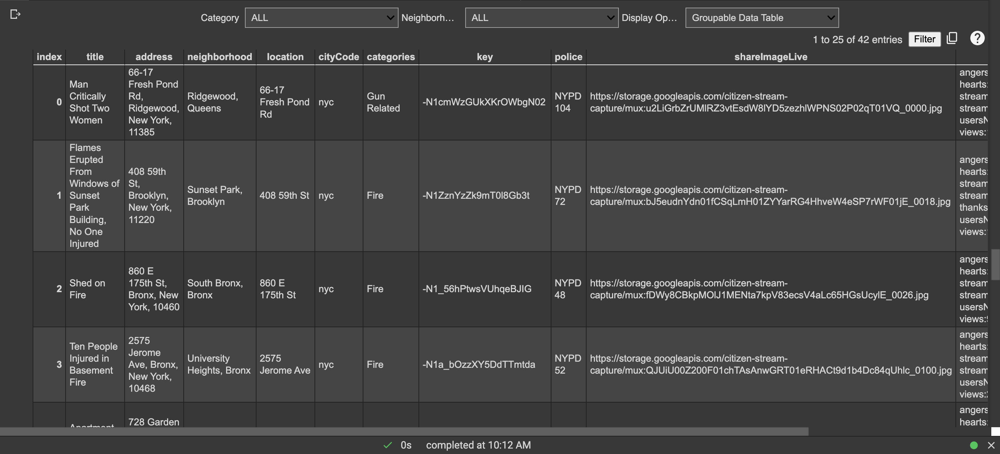
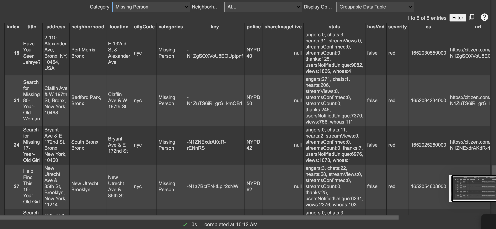
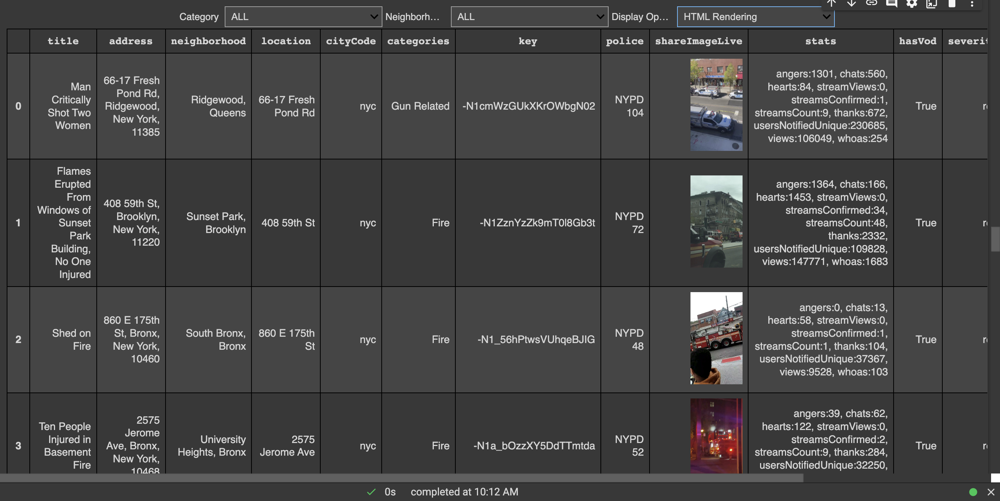
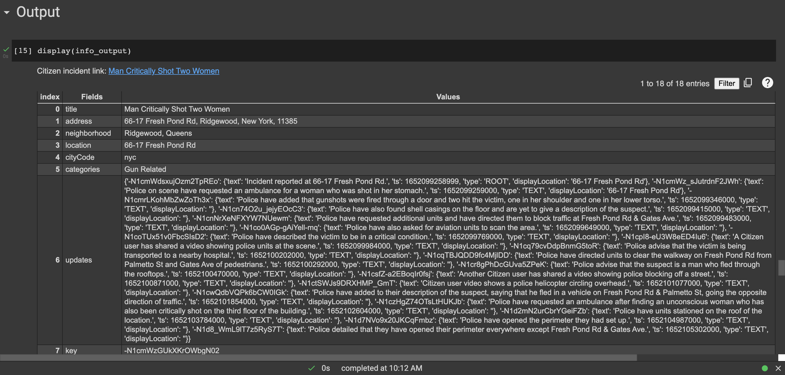
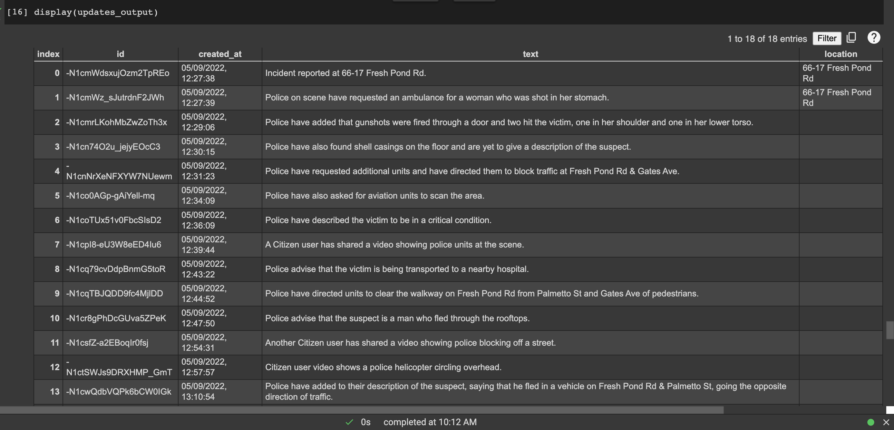
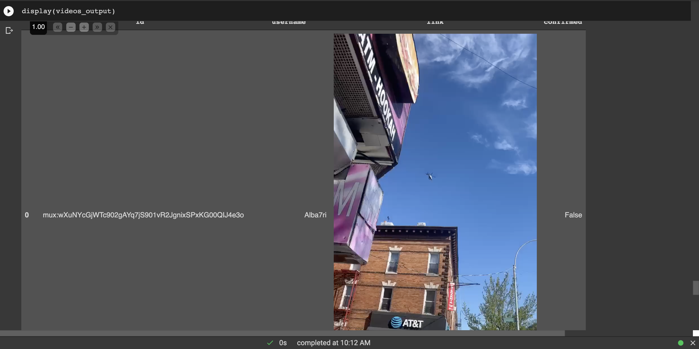
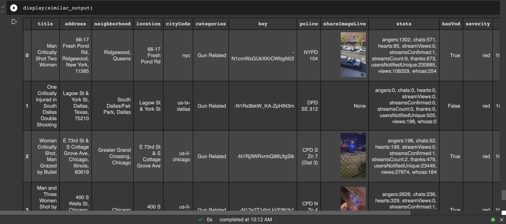

# Citizen Scraper

Citizen scraper allows users to explore citizen data directly within a google colab instance. Users are able to search data by location, category and severity. Clicking on an incident will show more information about the incident, pull in updates, and showcase similar incidents based on location and time. The goal of this interactive colab is to present another data source to journalists to explore and cover potentially interesting events. Many of these incidents provide video data and images that can be referred to by journalism organizations focused on local news when covering crime occurrences.

## Methodology
The scraper endpoints were found by going to the [citizen explore site](https://citizen.com/explore) and looking through the network activity. By combing through the network calls, I found that Citizen has API endpoints that are called in order to present data on the front-end, but Citizen does not provide a public API for its users. After looking through a few endpoints, I summed up most of the functionality below:

## Endpoints
- Incidents can be found at the `https://citizen.com/api/incident/` endpoint and stats can be pulled by attaching a `/stats` route at the end of it.
- Searches can be done through `https://citizen.com/api/incident/search?` and by attaching query parameters. 
	- To search by terms, attach `?q={your_search_term}`. This is able to search by both title, category, and cityCode.
- In addition, you can also search by trending incidents through `https://citizen.com/api/incident/trending?`
	- To search by location, add bounding boxes using query params in the form of `?insideBoundingBox[0]={latitude[0]}&insideBoundingBox[2]={latitude[1]}&insideBoundingBox[1]={longitude[0]}&insideBoundingBox[3]={longitude[1]}`
An example endpoint would be:
```
https://citizen.com/api/incident/trending?lowerLatitude=40.25119636738148&lowerLongitude=-74.28919064777256&upperLatitude=41.199425961910805&upperLongitude=-73.64280935222831
```
## Code Walkthrough
I broke up the colab code into 7 main sections: Scrape functions, Scraping by location, Display, Formatters, Data Handling and Display, Interactables, and Output.

### Scrape Functions
The Scrape Functions section holds most of the scraping capability using the endpoints. I tried making these functions in a way where they gave the user freedom in using them. Here, we have functions that are able to sort by location, keywords, and terms as well as sort data based on category, updates, and by relevant fields. The citizen API returns data for a ton of fields that consist of mostly metadata, so we can define a series of categories that we are interested in that are returned. We also scrape by interesting categories which are defined at the top.

### Scraping by location
Here, we do an example by scraping by incidents with the city code `nyc`. We are automatically sorting by red severity in order to filter out small unconfirmed reports on citizen. We sort by the relevant fields defined at the top of the colab and sort by usersNotified in order to get the incidents with the highest relevance and coverage first as determined by citizen. We store this data in a pandas dataframe.

### Display
This section was used to import most of the libaries that build the interactive and display part of the colab. I opted to go with `ipywidgets` because of their flexibility. `ipywidgets` provides support for an [extensive number of interactive widgets](https://ipywidgets.readthedocs.io/en/latest/examples/Widget%20List.html) that can be used to interact with the data. It also allows the widgets to be displayed in a format that is up to the developer, allowing for customization and styling.

From `IPython.display`, I use display as the main way to attach outputs to the `widget.Output`'s which are ways to determine sections where outputs to go in order to have greater control over what is displayed. For example, we are able to clear outputs and display entirely new information in them based on where the output object is displayed. I also took advantage of the ability to embed HTML and Javascript code in the colab/jupyter notebook environments. Lastly, I take advantage of colab's `enable_dataframe_formatter()` function that [presents pandas dataframes in an interactive format](https://colab.research.google.com/notebooks/data_table.ipynb) that is easier to navigate (and also allows export functionalities!)

### Formatters
This section mostly just contains formatters for the dataframes. `dataframe_html_string` is a template that takes in a dataframe table that has injected javascript code that loops over the dataframe rows and adds click listeners to them that invokes a function to display additional incident data. Additionally, there are functions that update the dataframes to render images and hyperlinks, which can only be done by first converting the dataframes into a HTML format. 

In `show_incident_data` we do a few things. This function is attached to each of the dataframe rows. When it is called, it takes in the key of the incident row selected and gets additional incident data through another endpoint call and displays it in a dataframe to the user. Additionally, we extract the updates and presents them in a table format instead of the original JSON format. Lastly, we search for similar incidents based on the title and display them with the `similar_output` output widget.

### Data Handling and Display

This section mainly consists of handlers for the widget interactives. We have 3 separate widgets: category to sort by category based on the data, neighborhood to sort by neighborhoods, and display to either present the data in a colab data table or in a HTML format.

We create these widgets and hook up the handlers to them. This allows us to only display the options based on the actual values of the data to prevent empty categories and neighborhoods. 

### Interactables

This section presents a box layout of the widgets to be on one row. Additionally, we display the table output whose output is determined by the widgets. Here, I present the two display options: Groupable Data Table and HTML rendering. Both of these have their pros and cons which I wanted to discuss.
- Groupable Data Table

&nbsp;&nbsp;&nbsp;&nbsp;&nbsp;&nbsp; This is the colab `data_table`. This option presents the data in a pretty neat table with indexes. By clicking on the headers, users are allowed to sort the data based on the column values. This allows for powerful exploration of the data and paired with the category and neighborhood widgets, allows for quick movement through the data. However, customization for the `data_table` is pretty difficult. There is not much documentation on it so it is difficult to define additional customizations on top of the table, so most of what is displayed is determined by the predefined functionality of the `data_table`.

- HTML Rendering

&nbsp;&nbsp;&nbsp;&nbsp;&nbsp;&nbsp;HTML Rendering renders the dataframe to HTML using the `dataframe_html_string` in the Formatters section. Here, we are able to customize the table by defining styling and javascript functionality that allows for more customization. We were also able to run formatters through the dataframe to convert links to hyperlinks and image links to the actual images. However, the con is that these HTML formats are hard to search through, but with additional javascript functionality, they can be customized further. However, this requires more work and there are not many predefined features.

### Output
Output hosts the `info_output`, `updates_output`, `videos_output` and `similar_output` which are filled on_click of the HTML rendered dataframe in Interactables. `info_output` presents the fields and values of the incident in a vertical view for easy lookup. `updates_output` presents the updates of the incident in a table. `videos_output` grabs all the video data and presents it in a easy to view table. Lastly, `similar_output` presents in a datatable incidents similar to the searched incident. Here, I used the same `dataframe_to_string` so this dataframe is also clickable to render more incidents to this output section.


## User Walkthrough
Here, the user is on the data explorer on the groupable data table

They may want to sort by a category, lets say `Missing Person`. They are presented with the data sorted only by that category

To view in HTML Rendering, they use the display option to switch to `HTML Rendering`. Here, all links and images are rendered completely.

They click on `Man Critically Shot Two Women` and scroll down to the display section. They are presented with the output in a vertical format

Scrolling down to `updates_output`, they read through the updates to the situation

`videos_output` takes the videos from the incident and displays them as videos that can be played directly into the colab. Here, this incident had around 10 videos

`similar_output` presents them with a list of similar incidents across locations. Clicking on any of these will allow them to rerender the display area and explore the data again


## Word about ipywidgets
I decided to go with colab because of the power of ipywidgets. Through only a few function definitions, ipywidgets allows users to interact with the data directly through the extensive list of widgets and display options. This leads to an user experience built entirely within the notebook that can be easily shared and iterated upon. It is great for proof of concept work that other developers can then examine while seeing the outputs directly on the same tab. Colab's ability to render HTML also provides an endless number of opportunities to add interactables through javascript.

Most of the interactive elements I implemented in this notebook is fairly experimental. I could not find any previous examples of making pandas dataframes themselves clickable, but I was able to figure it out by rendering HTML with embedded javascript. I also used output widgets in a unique way that get rendered by a python function attached to each row using javascript. To do this, I used `google.colab.kernel.invokeFunction` which allows notebook functions to be called in embedded code. More information about this can be found [here](https://colab.research.google.com/github/ektaarora3501/tensorflow/blob/master/advanced_outputs.ipynb). 

## Future Work
For a computational journalism tool to be useful, it must satisfy these major categories: proximity, prominence, timeliness and relevance, novelty, human interest, and surprise

In terms of proximity, prominence, timeliness and relevance, I chose to emphasize these by allowing users to sort by location, neighborhood, and severity, displaying those with highest number of notified users to the user first. Hopefully, human interest may be sparked by being able to explore an incident more through its updates and video data.

However, right now, it is difficult to comb through the thousands of incidents to target those that spark human interest or surprise. Additional NLP analysis can be done on the titles and updates provided by incidents to target those that might provide the most shock or spark the most curiosity by a user.

Additionally, to place the incidents in a wider context in terms of trends, additional statistics can be displayed to the reader including number of similar incidents over time compared to other years and cities. Right now, I could not find a way to sort incidents between dates without having to manually collect data over time, but this ability would allow for greater analysis by grabbing data from any time period in citizen history. I have confirmed that old incidents are still viewable if you know the ID, but they are hidden from search calls to the API. According to [this article](https://www.vice.com/en/article/pkbg89/hacker-hacktivist-citizen-app-scrape-dark-web), it seems like this should be possible, so further experimentation has to be done on my end. 

## Research Done
Throughout the semester, I combined most of my research into one google document. I made it viewable by all Columbia email users and it can be found [here](https://docs.google.com/document/d/1JfjuDfwODZVikj3G2yaywOIeQaScOjbo_O40IaKg6vs/edit?usp=sharing). Thank you Lydia Chilton, Savvas Petridis, and Jason Kao for all your advice and feedback this semester! :)


